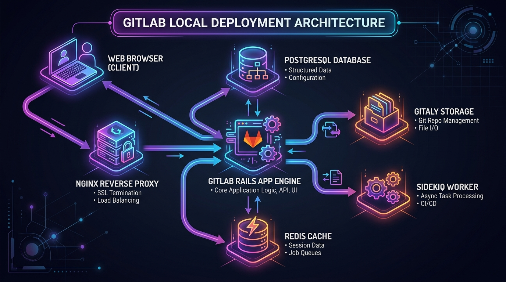
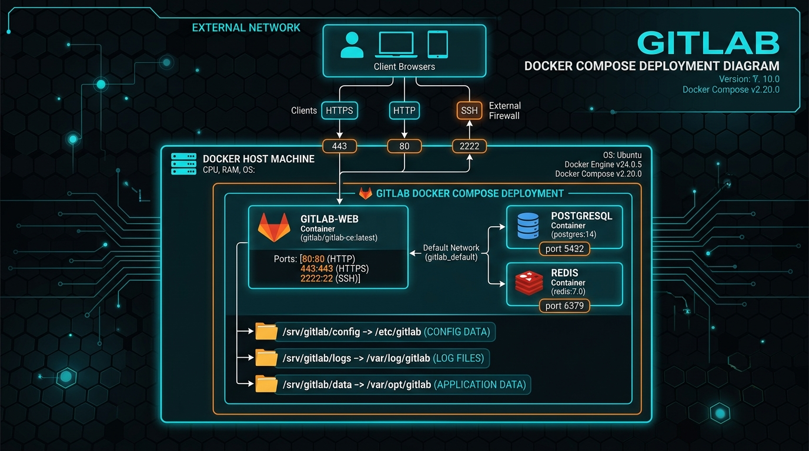
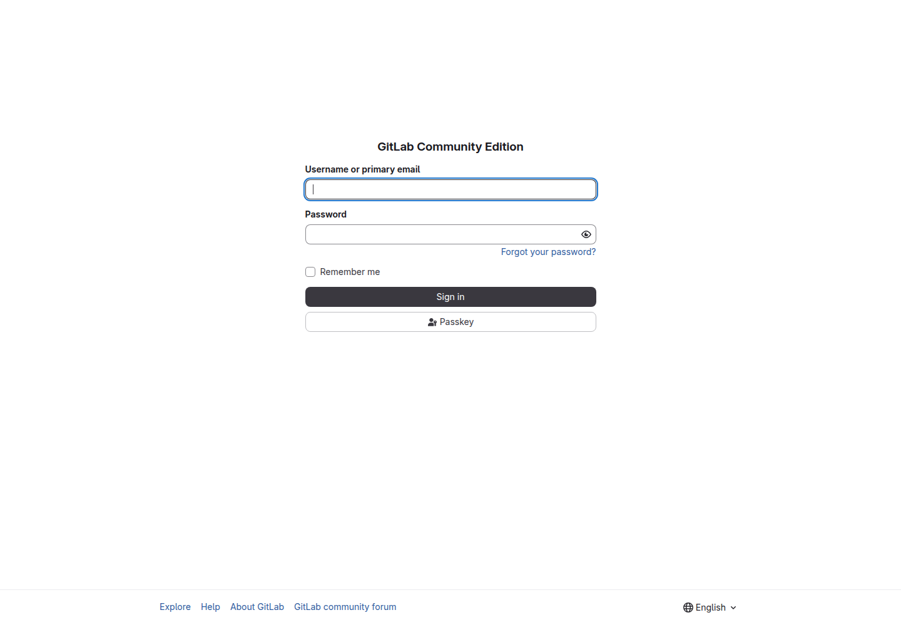
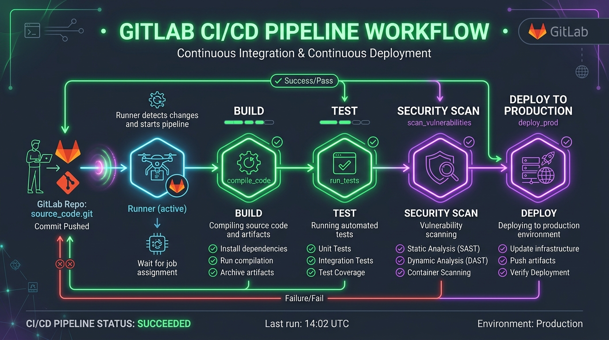

# 🚀 GitLab CE 19.2 完整安装、使用与管理员实战指南

> **版本支持**：GitLab Community Edition (CE) 19.2.1
> **适用环境**：Ubuntu 20.04/22.04/24.04 LTS、Debian 11/12、CentOS 7/8/9、Rocky Linux、Windows WSL2 / Docker Desktop
> **维护者**：sheng13 社区教程

---

## 📌 目录

- [这台虚拟机的文件放在哪里](#这台虚拟机的文件放在哪里)
- [零基础先修：GitLab 到底是什么](#零基础先修gitlab-到底是什么)
- [第一次打开网页：跟着做一次](#第一次打开网页跟着做一次)
- [一、前言与硬件环境要求](#一-前言与硬件环境要求)
- [二、GitLab 整体系统架构图解](#二-gitlab-整体系统架构图解)
- [三、Docker Compose 安装](#三-部署方案一基于-docker-compose-本地一键部署强烈推荐)
- [四、Linux 原生包安装](#四-部署方案二linux-原生包安装-omnibus-package)
- [五、首次登录与安全配置](#五-首次登录与系统初始化安全配置)
- [六、核心使用与权限管理](#六-gitlab-核心使用指南与权限管理)
- [网页功能完整导览](#打开-gitlab-网页后完整功能导览)
- [一般用户与管理者的差别](#角色与管理范围最重要的差别)
- [管理员 Admin Area 完整操作](#管理员-admin-area-完整操作)
- [七、CI/CD 与 Runner](#七-gitlab-cicd-自动化流水线实战)
- [八、备份、校验与恢复](#八-数据备份恢复与定时维护)
- [九、常见故障排查](#九-常见故障排查-troubleshooting-faq)
- [升级、安全验收与本机实测](#升级安全验收与本机实测)
- [十、GitHub 提交与版本管理](#十-github-仓库提交与版本管理指南)

---

## 这台虚拟机的文件放在哪里

### 1. 教程、图片和 PDF

```text
/home/wsfoo/gitlab-deployment-guide/
├── README.md                         仓库首页说明
├── gitlab_deployment_guide.md        完整中文教程原稿
├── GitLab_Local_Deployment_Guide.pdf 可以直接阅读/下载的 PDF
├── images/                           教程图片与登录页截图
├── examples/docker-compose.yml       可参考的部署范例
├── generate_pdf.js                   把 Markdown 转成 PDF 的程序
├── package.json                      PDF 构建命令与依赖
└── .git/                             Git 历史，不要手动修改
```

打开文件管理器后依序进入 **Home → gitlab-deployment-guide**。终端可用：

```bash
cd /home/wsfoo/gitlab-deployment-guide
ls -lh
xdg-open GitLab_Local_Deployment_Guide.pdf
```

如果只想阅读，打开 PDF；如果想修改教程，编辑 `gitlab_deployment_guide.md` 后执行 `npm run pdf` 重新生成 PDF。

### 2. GitLab 正在使用的服务资料

```text
/home/wsfoo/gitlab/
├── docker-compose.yml   容器版本、端口和挂载设置
├── config/              gitlab.rb、gitlab-secrets.json、证书、SSH 主机密钥
├── logs/                GitLab 各服务日志
└── data/                数据库、Git 仓库、上传、Artifacts 和应用备份
    └── backups/         gitlab-backup create 产生的 tar
```

这些是正在运行的正式资料。不要用文件管理器随意搬动、改名或删除 `config`、`data` 内的文件，也不要直接编辑数据库或仓库内部文件。配置通常只修改 `config/gitlab.rb`，修改前备份，之后执行：

```bash
docker exec gitlab gitlab-ctl reconfigure
```

### 3. 升级前独立配置备份

```text
/home/wsfoo/gitlab-backups/2026-08-10-before-19.2.1-upgrade/
└── etc-gitlab/    升级前的配置、secrets 与 SSH 主机密钥副本
```

GitLab 应用备份目前位于：

```text
/home/wsfoo/gitlab/data/backups/1786350457_2026_08_10_19.2.0_gitlab_backup.tar
```

配置备份目录和应用 tar 必须一起保护。它们可能包含敏感资料，不能上传 GitHub、寄邮件或放进公开共享目录。为了防止虚拟机磁盘损坏，之后还要复制到另一台机器或加密外接磁盘。

### 哪些文件会上传 GitHub

只上传 `/home/wsfoo/gitlab-deployment-guide` 里的公开教程、示例、图片和 PDF。以下内容绝不上传：

- `/home/wsfoo/gitlab/config/gitlab-secrets.json`
- `/home/wsfoo/gitlab/config/ssh_host_*_key`
- 任何真实 Token、密码或私钥
- `/home/wsfoo/gitlab/data/backups/*.tar`
- `/home/wsfoo/gitlab-backups/` 的真实配置备份

## 零基础先修：GitLab 到底是什么

GitLab 可以想成“团队自己的代码与工作管理网站”。它不只是放文件，还会记录谁改了什么、为什么修改、有没有经过检查，以及自动测试是否通过。

### 先认识最常见名词

| 名词 | 白话解释 | 类比 |
|---|---|---|
| Git | 记录文件每次变化的工具 | 会记住每个版本的无限次另存新档 |
| Repository（仓库） | 项目文件及全部修改历史 | 可以回到旧版本的文件柜 |
| Project（项目） | 仓库加 Issue、MR、CI/CD、成员和设置 | 一个完整工作空间 |
| Group（群组） | 集中放项目和成员 | 公司部门资料夹 |
| Branch（分支） | 从当前版本分出独立修改线 | 拿副本修改，不碰正式版 |
| Commit（提交） | 一次有说明、作者和时间的版本记录 | 可追踪存档点 |
| Clone | 第一次把完整仓库复制到电脑 | 下载项目及历史 |
| Pull | 把 GitLab 最新内容取回电脑 | 同步团队更新 |
| Push | 把电脑上的 commits 上传 | 上传你的新版本 |
| Issue | 需求、Bug 或待办 | 一张工作单 |
| Merge Request（MR） | 请求把分支修改合并，并请人审查 | 送出修改申请 |
| Pipeline | 自动测试、构建、部署流程 | 自动品管生产线 |
| Job | Pipeline 的一项工作 | 一个工站 |
| Runner | 真正执行 Job 的程序或机器 | 负责动手的工人 |
| Token | 可限制权限和期限的程序凭证 | 可撤销的临时电子钥匙 |
| SSH Key | 公钥验证电脑，私钥留在自己电脑 | 公钥是锁，私钥是钥匙 |

网页适合建立项目、Issue、MR、成员和查看 Pipeline；终端负责修改文件并上传。`git add` 是选择下次要记录的文件，`git commit` 是在本机建立记录，`git push` 才是真正上传。只有 commit 没有 push，其他人看不到。

## 第一次打开网页：跟着做一次

### 第 1 步：登录

1. 浏览器输入 `http://192.168.70.196:8080`，不要输入 8022。
2. Username or primary email 填管理员给你的用户名。
3. Password 填密码，选择 **Sign in**。
4. 若要求 2FA，输入验证器的六位数；恢复代码只在遗失验证器时使用。

登录失败先检查大小写、输入法和 Caps Lock，不要连续猜测导致账号锁定。

### 第 2 步：保护自己的账号

右上角头像进入 **Edit profile** 或 **Preferences**：

1. Profile：确认名称和邮箱。
2. Password：第一次登录立即更换唯一强密码。
3. Two-factor authentication：扫描 QR code，并离线保存恢复代码。
4. Notifications：初学者建议 Participating，避免邮件过多。
5. SSH Keys：需要从电脑 push 时加入公钥。
6. Access Tokens：只有 API 确实需要才建立；选最少 scope、设到期日，不能截图公开。

### 第 3 步：找到项目

首页通常显示最近项目、活动或 To-Do。选择顶部 **Search or go to** 输入项目名。找不到项目通常表示还没被加入、Private 项目不可见或邀请未接受，应请项目 Maintainer 检查成员，而不是直接索取系统管理员权限。

### 第 4 步：建立练习项目

1. 顶部 **Create new**（加号）→ **New project/repository**。
2. 选择 **Create blank project**。
3. Project name 输入 `my-first-project`。
4. Namespace 选择自己的用户名。
5. Visibility Level 选择 **Private**。
6. 勾选 **Initialize repository with a README**。
7. 选择 **Create project**；看到 README 就表示成功。

如果没有 New project，是账号被限制建立项目，并非系统坏掉。请让群组 Owner 在正确群组建立。

### 第 5 步：只用网页修改文件

1. 项目左侧 **Code → Repository**，打开 `README.md`。
2. 选择 **Edit → Edit single file**。
3. 在末尾加入一句说明。
4. Commit message 输入 `docs: update README`。
5. 默认分支受保护时，选择建立新分支并发起 MR，不要关闭保护。
6. 选择 **Commit changes**，再检查绿色新增与红色删除。

### 第 6 步：建立 Issue

1. 左侧 **Plan → Issues → New issue**。
2. Title 写结果，例如“在 README 加入安装步骤”。
3. Description 写背景、要做什么、完成标准，可用 `- [ ]` 建检查清单。
4. Assignee 是负责人；Label 是分类；Milestone 是目标阶段。
5. 选择 **Create issue**，记住编号，例如 `#1`。

补充信息用评论，避免偷偷改掉原描述导致讨论失去脉络。

### 第 7 步：建立 Merge Request

1. 从 Issue 选择 **Create merge request and branch**。
2. 在新分支修改文件并 commit。
3. 进入 **Code → Merge requests** 打开这个 MR。
4. Description 写修改内容、测试结果、风险与 `Closes #1`。
5. Assignee 是执行者，Reviewer 是审查者。
6. 在 **Changes** 检查差异，确认没有密码或无关文件。
7. 在 **Pipelines** 等自动测试通过。
8. 回应 Reviewer 的讨论，修改后再次 push，MR 会自动更新。
9. 有权限者选择 Merge；回到 Issue 确认已关闭。

### 第 8 步：从电脑操作

```bash
git --version
git config --global user.name "你的名称"
git config --global user.email "你的 GitLab 邮箱"
ssh-keygen -t ed25519 -C "你的 GitLab 邮箱"
cat ~/.ssh/id_ed25519.pub
```

只复制以 `ssh-ed25519` 开头的 `.pub` 公钥到 **头像 → Preferences → SSH Keys**。没有 `.pub` 的是私钥，绝不能复制给任何人。

```bash
ssh -T -p 8022 git@192.168.70.196
git clone ssh://git@192.168.70.196:8022/你的群组/你的项目.git
cd 你的项目
git pull --rebase origin main
git switch -c feat/issue-1-readme
# 修改文件后
git status
git diff
git add README.md
git commit -m "docs: add installation steps"
git push -u origin feat/issue-1-readme
```

不要在不理解时使用 `git push --force`，它可能改写远端历史。

### 做完后应该看到什么

- Project 首页有文件和 commit 历史。
- Issue 有编号、负责人和状态。
- MR 显示差异、讨论与 Pipeline 状态。
- 合并后默认分支出现修改。
- 本机 `git status` 显示工作区 clean。

只在电脑看到修改通常是还没 push；GitLab 有更新但电脑没有，通常需要 pull；出现无权限则检查成员角色和分支保护。

## 一、 前言与硬件/环境要求

GitLab 是目前业界使用最广泛的开源 DevOps 平台，集成了代码托管、Issue 追踪、Merge Request 代码审查、CI/CD 自动化持续集成与部署、Package 依赖包管理以及安全扫描等全套功能。

### 1.1 硬件配置推荐

GitLab 是基于 Ruby on Rails、Go、Vue.js 及 PostgreSQL 构建的大型应用，在本地部署时对内存与 CPU 资源有一定要求：

| 评估维度 | 最低配置 (极简体验) | 推荐配置 (小团队 1-20人) | 生产推荐 (20-100人) |
| :--- | :--- | :--- | :--- |
| **CPU 核心数** | 2 核 (Dual-Core) | 4 核 (Quad-Core) | 8 核以上 |
| **内存 (RAM)** | 4 GB (需配置 4GB SWAP) | 8 GB RAM | 16 GB RAM 以上 |
| **磁盘空间** | 20 GB NVMe/SSD | 100 GB+ SSD | 500 GB+ 高速 SSD |
| **操作系统** | Linux (Ubuntu/Debian/CentOS) 或 Windows 11 (WSL2 Docker) |

> 💡 **关键建议**：如果服务器只有 4GB 内存，**必须手动开启至少 4GB 的 SWAP 交换内存**，并在 `gitlab.rb` 中限制 Puma 进程数和 PostgreSQL 缓冲区，否则启动时极易发生 502 错误或内存溢出 (OOM Killer)。

---

## 二、 GitLab 整体系统架构图解

下图展示了 GitLab 本地私有化部署的核心架构，包括前端反向代理、应用核心组件、数据存储与后台任务调度协同关系：



### 核心组件职责解析：
1. **Nginx**：作为前端入口反向代理，处理 HTTP/HTTPS 请求与 SSL 证书解密。
2. **Puma**：GitLab 核心 Web 应用服务器（基于 Ruby on Rails），处理业务逻辑与页面渲染。
3. **Workhorse**：高性能 Go 语言智能反向代理，处理大文件上传/下载、Git HTTP 操作与 Websocket。
4. **Gitaly**：GitLab 专属的 Go 语言 RPC 服务，高效处理所有 Git 磁盘读写与 Repository 操作。
5. **PostgreSQL**：元数据库，存储用户、项目信息、Issue、Merge Request 等元数据。
6. **Redis**：缓存系统与 Sidekiq 任务队列底座。
7. **Sidekiq**：异步后台任务执行器（如邮件发送、CI/CD 调度、代码统计等）。

---

## 三、 部署方案一：基于 Docker Compose 本地一键部署（强烈推荐）

使用 Docker Compose 是最推荐的部署方式，具有环境隔离、升级便捷、配置解耦等极大优势。

### 3.1 部署架构与网络拓扑



### 3.2 步骤 1：创建本地存储目录

在宿主机上创建持久化数据目录，确保容器毁弃重建后数据不丢失：

```bash
sudo mkdir -p /srv/gitlab/config
sudo mkdir -p /srv/gitlab/logs
sudo mkdir -p /srv/gitlab/data
```

### 3.3 步骤 2：编写 `docker-compose.yml` 生产级配置文件

在 `/srv/gitlab` 目录下创建 `docker-compose.yml` 文件：

```yaml
version: '3.8'

services:
  gitlab:
    image: 'gitlab/gitlab-ce:19.2.1-ce.0'
    container_name: 'gitlab'
    restart: always
    hostname: 'gitlab.local'
    environment:
      GITLAB_OMNIBUS_CONFIG: |
        # 外部访问 URL (替换为您的宿主机实际 IP 或域名)
        external_url 'http://192.168.70.196:8080'
        nginx['listen_port'] = 80

        # 修改 GitLab 内置 SSH 端口以避免与宿主机 22 端口冲突
        gitlab_rails['gitlab_shell_ssh_port'] = 8022

        # 时区设置
        gitlab_rails['time_zone'] = 'Asia/Shanghai'

        # -----------------------------------------------------------------
        # 内存性能优化配置 (适合 4GB ~ 8GB 内存的环境)
        # -----------------------------------------------------------------
        puma['worker_processes'] = 2
        puma['per_worker_max_memory_mb'] = 1024
        sidekiq['max_concurrency'] = 10
        postgresql['shared_buffers'] = "256MB"
        prometheus_monitoring['enable'] = false

    ports:
      - '8080:80'     # Web HTTP 访问端口
      - '8443:443'   # HTTPS 端口 (如启用 SSL)
      - '8022:22'    # Git SSH 提交端口
    volumes:
      - '/srv/gitlab/config:/etc/gitlab'
      - '/srv/gitlab/logs:/var/log/gitlab'
      - '/srv/gitlab/data:/var/opt/gitlab'
    shm_size: '256m'
```

### 3.4 步骤 3：启动容器并查看日志

执行以下命令启动 GitLab 服务：

```bash
cd /srv/gitlab
# 启动容器
docker compose up -d

# 实时查看启动日志 (首次启动需要 2 ~ 5 分钟进行数据库初始化)
docker logs -f gitlab
```

---

## 四、 部署方案二：Linux 原生包安装 (Omnibus Package)

如果您希望直接在 Linux 物理机或虚拟机上原生运行，可以使用 GitLab Omnibus 官方/镜像源安装。

### 4.1 安装基础依赖 (以 Ubuntu/Debian 为例)

```bash
sudo apt-get update
sudo apt-get install -y curl openssh-server ca-certificates tzdata perl
```

### 4.2 配置清华大学开源软件镜像源 (加速下载)

创建并修改包源文件 `/etc/apt/sources.list.d/gitlab.list`：

```bash
curl -fsSL https://packages.gitlab.com/gpg.key | sudo gpg --dearmor -o /etc/apt/trusted.gpg.d/gitlab.gpg
echo "deb https://mirrors.tuna.tsinghua.edu.cn/gitlab/ubuntu jammy main" | sudo tee /etc/apt/sources.list.d/gitlab.list
```

### 4.3 执行安装与重配置

```bash
sudo apt-get update
# 安装 GitLab CE 最新版本
sudo EXTERNAL_URL="http://192.168.70.196" apt-get install gitlab

# 首次重配置与初始化 (生成配置文件并启动所有服务)
sudo gitlab-ctl reconfigure
```

### 4.4 常用 `gitlab-ctl` 管理命令

- 启动服务：`sudo gitlab-ctl start`
- 停止服务：`sudo gitlab-ctl stop`
- 重启服务：`sudo gitlab-ctl restart`
- 查看状态：`sudo gitlab-ctl status`
- 实时日志：`sudo gitlab-ctl tail`

---

## 五、 首次登录与系统初始化安全配置



### 5.1 获取管理员 `root` 默认密码

GitLab 在安装完成后会自动生成一个随机初始密码，有效期为 24 小时：

```bash
# Docker 部署方式获取：
docker exec -it gitlab cat /etc/gitlab/initial_root_password

# 原生安装方式获取：
sudo cat /etc/gitlab/initial_root_password
```

### 5.2 登录界面与修改 Root 密码

1. 在浏览器中打开：`http://<您的服务器IP>:8080`
2. 用户名输入 `root`，密码输入上一步获取到的字符串。
3. 登录后立即进入 **Admin Area (管理员区域)** -> **Users** -> **Edit Root**，重置密码为强密码并保存。

### 5.3 开启中文语言界面

1. 点击右上角用户头像 -> **Preferences (首选项)**。
2. 滚动找到 **Localization (本地化)** -> **Language (语言)**。
3. 选择 **简体中文**，点击 **Save changes**，刷新页面即可呈现全中文界面。

### 5.4 安全加固与 SMTP 发信设置

修改配置文件 `/srv/gitlab/config/gitlab.rb` 或 Docker 中的 `GITLAB_OMNIBUS_CONFIG`，添加 SMTP 邮箱发信支持（以 QQ 企业邮箱/网易邮箱为例）：

```ruby
gitlab_rails['smtp_enable'] = true
gitlab_rails['smtp_address'] = "smtp.exmail.qq.com"
gitlab_rails['smtp_port'] = 465
gitlab_rails['smtp_user_name'] = "notification@yourdomain.com"
gitlab_rails['smtp_password'] = "YourAuthorizedPassword"
gitlab_rails['smtp_authentication'] = "login"
gitlab_rails['smtp_enable_starttls_auto'] = false
gitlab_rails['smtp_tls'] = true
gitlab_rails['gitlab_email_from'] = 'notification@yourdomain.com'
```

保存后重新运行：`docker exec -it gitlab gitlab-ctl reconfigure`。

---

## 六、 GitLab 核心使用指南与权限管理

### 6.1 GitLab 组织架构与 5 大角色权限

GitLab 遵循 `Group (项目组) -> Sub-group (子组) -> Project (项目)` 的树状结构。

```
🏢 公司/团队 (Group)
 ├── 📁 前端团队 (Sub-group)
 │    ├── 📦 Vue3-App (Project)
 │    └── 📦 Design-System (Project)
 └── 📁 后端团队 (Sub-group)
      └── 📦 Go-Microservice (Project)
```

#### 成员角色权限对比：

| 角色 (Role) | 代码 Clone/Pull | 代码 Push | 创建分支/MR | 修改项目设置 | 管理组员与权限 |
| :--- | :---: | :---: | :---: | :---: | :---: |
| **Guest (访客)** | ❌ (受限) | ❌ | ❌ | ❌ | ❌ |
| **Reporter (报告者)** | 选定项目 | ❌ | ❌ | ❌ | ❌ |
| **Developer (开发者)** | ✅ | ✅ (未受保护分支) | ✅ | ❌ | ❌ |
| **Maintainer (维护者)**| ✅ | ✅ (所有分支) | ✅ | ✅ | ❌ |
| **Owner (所有者)** | ✅ | ✅ | ✅ | ✅ | ✅ |

### 6.2 本地配置 SSH Key 密钥

在本地开发机终端中生成 SSH 密钥并添加到 GitLab，以实现免密 Pull/Push：

```bash
# 1. 生成 Ed25519 密钥
ssh-keygen -t ed25519 -C "your_email@example.com"

# 2. 查看并复制公钥内容
cat ~/.ssh/id_ed25519.pub

# 3. 在 GitLab Web 界面中操作：
# 点击右上角头像 -> 编辑个人资料 -> SSH 密钥 -> 添加新密钥 -> 粘贴并保存。
```

### 6.3 保护分支 (Protected Branches) 与 Code Review 流水线

1. 进入项目 **设置 (Settings)** -> **仓库 (Repository)** -> **受保护分支 (Protected branches)**。
2. 将 `main` 或 `master` 分支设置为：
   - **Allowed to push**: `No one` (禁止任何人直接 Push 代码)
   - **Allowed to merge**: `Maintainers` (仅允许维护者审核 Merge Request 后合并)
3. 开发者标准工作流：
   - 本地创建特性分支：`git checkout -b feature/login-page`
   - 提交代码并推送：`git push origin feature/login-page`
   - 在 GitLab 界面发起 **Merge Request (MR)**，等待 Leader 审查合并。

---

## 打开 GitLab 网页后：完整功能导览

登录 `http://192.168.70.196:8080` 后，你看到的是工作区，不是系统管理后台。页面会随版本、授权方案、个人权限与项目启用功能略有差异。

### 顶部与首页功能

| 位置 | 功能 | 一般使用者怎么用 | 管理者关注点 |
|---|---|---|---|
| **Search or go to** | 搜索项目、群组、Issue、MR，也可快速跳转 | 输入项目名或按快捷键进入 | 管理员可从这里进入 Admin area |
| **Create new**（`+`） | 建项目、群组、Snippet | 按权限建立个人项目或工作项 | 限制谁能建立顶层群组和公开项目 |
| **To-Do List** | 待处理通知 | 把 MR 审查、Issue 指派标记完成/稍后 | 不能当正式审计或项目排期工具 |
| **Issues / Merge requests** | 汇总自己可见范围的工作 | 查看指派给我、我建立或参与的项目事项 | 项目负责人追踪阻塞与审查积压 |
| **头像菜单** | 个人资料、偏好、Token、SSH Key、2FA、登出 | 管理自己的身份与通知 | Admin Mode 开启时可在这里进入管理模式 |
| **Admin** | 实例管理后台 | 一般用户看不到 | 只有 Self-Managed 实例 Administrator 可见 |

首次使用建议依序完成：修改密码 → 启用 2FA → 加入 SSH 公钥 → 调整通知 → 找到所属群组 → 进入项目。

### 进入一个 Project 后，左侧菜单逐项说明

| 菜单 | 里面有什么 | 最常见操作 | 谁负责 |
|---|---|---|---|
| **Project overview** | README、描述、成员、统计、最近活动 | 先看 README、Clone 地址和默认分支 | 所有人阅读，Maintainer 维护说明 |
| **Plan → Issues** | 工作项、Bug、需求、指派、标签、里程碑 | New issue、指派负责人、设 due date、关联 MR | Developer 建立；负责人规划 |
| **Plan → Issue boards** | 看板列和拖放卡片 | 依标签建立 To do/Doing/Done | 项目负责人维护流程 |
| **Code → Repository** | 文件、分支、Commits、Tags、Graph、Compare | 浏览代码、复制 clone URL、建立分支 | Developer 日常使用 |
| **Code → Merge requests** | 代码审查、讨论、差异、审批 | 建 MR、请求 reviewer、解决 thread、合并 | Developer 提交；Maintainer 治理 |
| **Build → Pipelines** | 每次 CI/CD 执行结果 | 看状态、重跑失败 Job、下载产物 | Developer 排错；Maintainer 管规则 |
| **Build → Jobs** | 单一 Job 日志 | 找第一条真正错误、重试或取消 | Developer/Reporter 依权限查看 |
| **Build → Artifacts** | 编译、测试报告、发布文件 | 下载或确认到期日 | Maintainer 控制保存期限与容量 |
| **Deploy** | Environments、Releases、Feature flags 等 | 看测试/正式环境状态、回滚部署 | 只给受控角色执行生产部署 |
| **Operate / Monitor** | 指标、错误、Kubernetes/运维功能（视配置） | 观察运行状态与告警 | 运维/维护者 |
| **Secure** | 安全扫描结果（部分功能依方案） | 处理依赖、秘密、容器漏洞 | 安全人员与 Maintainer |
| **Manage → Members** | 直接、继承、共享成员及到期日 | Invite members、改角色、移除访问 | Maintainer/Owner |
| **Settings** | General、Integrations、Repository、CI/CD、Access Tokens | 保护分支、变量、Webhook、项目可见性 | Maintainer 可管理多项；删除等高风险操作限 Owner |

如果某个菜单没出现，通常是：你的角色不够、项目关闭该功能、GitLab CE/方案不包含，或管理员全局禁用；不一定是故障。

### 一个普通用户的完整工作实例

1. 从顶部搜索进入项目，先读 README、贡献规范和 Issue 模板。
2. 到 **Plan → Issues** 建立 Issue，标题写结果，描述写背景、验收条件和复现步骤。
3. 在 Issue 页面选择 **Create merge request and branch**，或本地建立 `feat/issue-123-login`。
4. 修改代码后运行本地测试，再 commit、push。
5. 打开 **Code → Merge requests**，填写变更摘要、测试结果、截图与风险，关联 `Closes #123`。
6. 在 **Changes** 检查自己实际提交的 diff，避免把密码、构建产物或无关文件带进去。
7. 在 **Pipelines** 等 CI 通过；失败时打开 Job 日志修复，不要直接要求跳过。
8. 指定 Reviewer，回应每条讨论并选择 Resolve thread。
9. Maintainer 审查后合并；确认 Issue 自动关闭、默认分支流水线成功，必要时建立 Release。

### 通知怎么用

头像 → **Preferences → Notifications** 可设全局通知；项目页面的通知设置可覆盖全局。建议普通成员使用 Participating 或自定义，不要全部 Watch，否则容易被大量邮件淹没。紧急告警应由监控系统负责，不能只依赖 GitLab 邮件。

## 角色与管理范围：最重要的差别

GitLab 有“实例管理员”和“项目/群组角色”两个不同系统。Administrator 是整台 Self-Managed GitLab 的超级管理权限；Maintainer/Owner 是某个项目或群组范围内的权限。

| 身份 | 范围 | 能做什么 | 不能/不应该做什么 |
|---|---|---|---|
| 一般登录用户（未加入项目） | 自己账号与可见的公开/内部内容 | 管理个人资料、SSH Key、Token；浏览有权内容 | 看不到 Private 项目，不能管理其他账号 |
| Guest / Planner | 指定项目或群组 | Guest 参与有限协作；Planner 偏规划功能（实际能力依版本） | 通常不能推代码或改仓库设置 |
| Reporter | 指定项目或群组 | 读取代码、Issue、MR、流水线和报告 | 不能向未保护分支 push |
| Developer | 指定项目或群组 | 推功能分支、建 Issue/MR、运行流水线 | 不应改关键项目设置或绕过保护分支 |
| Maintainer | 指定项目或群组 | 管分支、MR、CI/CD 设置与项目成员 | 不是系统管理员；不能任意管理其他项目或全站用户 |
| Owner | 群组/项目最高治理范围 | 管群组成员、可见性、共享与高风险操作 | 仍不能进入实例 Admin；Owner 应极少 |
| Administrator | 整个 GitLab 实例 | Admin area、全站用户/项目/Runner/设置/监控 | 日常开发不应一直依赖超级权限 |

同一人可在 A 项目是 Developer、B 群组是 Owner。权限继承时以有效的较高角色为准，因此修改成员角色前要检查他是否从父群组继承权限。

### 谁来做什么：实务分工

- 一般使用者：维护自己的密码、2FA、SSH Key；写 Issue、代码与 MR；保护自己的 Token。
- Developer：负责功能分支、测试、Pipeline 和修正审查意见。
- Maintainer：保护默认分支、审核合并、维护 CI/CD、变量、Webhook、成员和项目容量。
- Group Owner：设计群组结构、成员继承、群组 Runner/变量和项目建立规则。
- Instance Administrator：账号生命周期、注册策略、全局安全、升级、备份、恢复、监控与容量；不代替项目负责人做日常代码决策。

## 管理员 Admin Area 完整操作

管理员从左上角菜单进入 **Admin**。这里管理整个实例，不是单一项目。

### 用户生命周期

在 **Admin → Overview → Users** 可建立、封锁、停用或删除用户。离职账号应先 Block，转移群组和项目所有权、撤销 Token 与 SSH Key，再按保留政策处理；不要一开始就删除。`Admin` 权限只给极少数可信人员。Impersonate 仅用于排障，结束后立即退出并保留审计记录。

### 群组、项目与权限

用顶层 Group 表示组织，再以 Subgroup 区分部门或产品，让项目继承群组成员。普通开发者给 Developer，负责人给 Maintainer，Owner 仅给群组负责人。项目默认 Private，并保护 `main`：禁止直接 push，要求 Merge Request、成功流水线和审查。

### 注册、可见性与系统设置

在 **Admin → Settings → General** 关闭公开注册，限制 Public/Internal 项目创建，设置默认项目可见性和新用户权限。保存后用普通账号或无痕窗口验证。

### 安全与凭证

管理员和 root 必须使用强密码及 2FA，恢复代码离线保存。个人访问 Token 只给必要 scope 并设置到期日；CI 秘密放在 masked/protected Variables，不写进仓库、URL 或日志。定期检查管理员、长期未用账号、过期 Token 与异常 Runner。


### Admin 左侧菜单逐项管理

| Admin 菜单 | 管理内容 | 建议操作频率 | 风险提醒 |
|---|---|---|---|
| **Overview → Users** | 用户状态、邮箱、2FA 筛选、最后活动、成员数 | 每周及到离职事件 | 删除前先封锁并转移所有权 |
| **Overview → Projects** | 全站项目、可见性、容量、归档/待删除 | 每周检查异常容量 | Delete 会影响业务资料 |
| **Overview → Groups** | 顶层群组与所有权 | 组织变动时 | 确保每个重要群组至少有可靠 Owner |
| **CI/CD → Runners** | Instance/Group/Project Runner | 每周 | 暂停离线或可疑 Runner；Token 泄漏立即轮换 |
| **CI/CD → Jobs** | 全站 Job 状态 | 故障或容量异常时 | 识别卡住、滥用资源的 Job |
| **Monitoring → System information** | CPU、内存、版本与系统状态 | 每日监控辅助 | 不能替代外部监控 |
| **Monitoring → Background jobs** | Sidekiq 队列、失败与延迟 | 队列告警时 | 不理解任务语义不要随意删除 |
| **Monitoring → Logs** | 应用日志入口（依版本） | 排障时 | 日志可能含隐私，限制读取和留存 |
| **Settings → General** | 注册、可见性、账号限制、命名与全局默认 | 初装及变更审批时 | 变更影响所有用户 |
| **Settings → CI/CD** | 全局流水线与 Runner 政策 | Runner 架构调整时 | 防止不可信 Job 接触秘密或 Docker socket |
| **Settings → Network** | 出站请求、Webhook 网络限制 | 接入系统时 | 防 SSRF，不要随意开放内网网段 |
| **Settings → Repository** | 仓库、镜像、存储相关全局规则 | 规划变更时 | 先在测试环境验证 |

### 建立一般用户

1. 右上角选择 **Admin**。
2. 左侧 **Overview → Users**。
3. 选择 **New user**。
4. 填 Name、Username、Email；Username 会影响个人 Namespace URL。
5. Access 区域不要勾 Administrator，除非此人确实负责整台实例。
6. 设项目数量或用户类型（如界面提供），选择 Create user。
7. 由 SMTP 寄送首次登录链接；若未配置邮件，应采用安全方式交付临时凭证，并要求立即改密码和设 2FA。
8. 到目标群组的 **Manage → Members** 加入正确角色，而不是直接给 Admin。

### 封锁、停用、删除有什么差别

- Block：立即禁止登录，资料与贡献保留；离职处理的第一步。
- Deactivate：适合不活跃账号管理；实际重新启用行为依实例设置。
- Ban：针对滥用账号，语义不同于正常离职。
- Delete user：删除账号；可选择是否连贡献一起处理，影响大且难逆转。

推荐离职清单：Block → 撤销会话/Token/SSH Key → 停用 Runner 凭证 → 转移群组 Owner 和项目责任 → 保存审计与合规资料 → 经过审批后决定保留或删除。

### 管理项目成员

项目内进入 **Manage → Members → Invite members**：输入现有用户名或邮箱，选角色与 Access expiration date 后邀请。临时外包一定设置到期日。继承成员必须回父群组修改，不能只在项目页改。Maintainer 能管理多数项目成员，但不应把别人提升为超出自己治理范围的角色。

### 注册策略

进入 **Admin → Settings → General → New user account restrictions**。内部实例建议关闭 **Allow new user accounts**；若允许注册，启用管理员审批与邮箱确认，并视需要设允许/拒绝邮箱域名。修改后用无痕窗口验证注册入口是否符合预期。

### 管理员日常/每周/月度清单

每日：确认 Web 健康、核心服务、磁盘、失败备份和严重告警。
每周：检查新管理员、Blocked/Pending 用户、离线 Runner、失败 Job、容量增长、备份校验与异机复制。
每月：修补版本、审查长期 Token/SSH Key、群组 Owner、公开项目、恢复演练记录、证书期限和 RTO/RPO。
每次变更：记录变更前状态与回退点，执行后测试登录、clone/push、MR、CI、邮件和备份。

### SMTP、限额与维护

配置 SMTP 后执行 `docker exec gitlab gitlab-ctl reconfigure` 并发送测试邮件。规划 Repository、LFS、Artifacts 与 Registry 限额，流水线产物设置 `expire_in`。管理员每周检查磁盘、Sidekiq、Runner、备份新鲜度与证书到期日。

## 七、 GitLab CI/CD 自动化流水线实战

GitLab 内置了强大的 CI/CD 引擎，只需在项目根目录创建 `.gitlab-ci.yml` 即可触发自动化构建与部署。

### 7.1 CI/CD 流水线工作原理图



### 7.2 步骤 1：本地部署并注册 GitLab Runner

GitLab Runner 是用于真正执行 CI/CD 任务的具体构建节点。

```bash
# 1. 运行 Docker 版本的 GitLab Runner
docker run -d --name gitlab-runner --restart always \
  -v /srv/gitlab-runner/config:/etc/gitlab-runner \
  -v /var/run/docker.sock:/var/run/docker.sock \
  gitlab/gitlab-runner:alpine-v19.2.1

# 2. 先在项目/群组 Runner 页面建立 Runner，再使用短期显示的 authentication token 注册
docker exec -it gitlab-runner gitlab-runner register \
  --non-interactive \
  --url "http://192.168.70.196:8080/" \
  --token "glrt-REDACTED" \
  --executor "docker" \
  --docker-image "node:18-alpine" \
  --description "Local-Docker-Runner" \
  --tag-list "docker,build"
```

### 7.3 步骤 2：编写 `.gitlab-ci.yml` 管道脚本

在代码项目根目录下创建 `.gitlab-ci.yml`：

```yaml
stages:
  - install
  - test
  - build
  - deploy

cache:
  paths:
    - node_modules/

install_deps:
  stage: install
  script:
    - npm install
  tags:
    - docker

run_tests:
  stage: test
  script:
    - npm run test
  tags:
    - docker

build_artifact:
  stage: build
  script:
    - npm run build
  artifacts:
    paths:
      - dist/
  tags:
    - docker

deploy_prod:
  stage: deploy
  script:
    - echo "Deploying build artifacts to production server..."
  only:
    - main
  tags:
    - docker
```

---

## 八、 数据备份、恢复与定时维护

数据安全是私有部署的重中之重。

### 8.1 一键执行备份

```bash
# Docker 容器执行备份命令：
docker exec -t gitlab gitlab-backup create

# 原生安装备份命令：
sudo gitlab-backup create
```

默认备份文件会保存在 `/var/opt/gitlab/backups`（挂载在宿主机的 `/srv/gitlab/data/backups`）目录下，文件名形如：`1786350457_2026_08_10_19.2.0_gitlab_backup.tar`。

> ⚠️ **完整备份有三层**：应用备份 tar；`/etc/gitlab` 内的 `gitlab.rb`、`gitlab-secrets.json`、证书和 SSH 主机密钥；镜像精确版本、Compose、端口、卷路径和 SHA-256 清单。缺少 secrets 可能无法解密 CI 变量与 Token。备份必须另存到另一台机器或加密存储。

### 8.2 设置 Linux Cron 定时自动备份脚本

在宿主机上创建自动备份脚本 `/usr/local/bin/gitlab_auto_backup.sh`：

```bash
#!/bin/bash
# 1. 执行备份
docker exec -t gitlab gitlab-backup create

# 2. 只有在备份成功后才生成校验清单；删除策略应另行审核
sha256sum /srv/gitlab/data/backups/*_gitlab_backup.tar > /srv/gitlab/SHA256SUMS
# 3. 另行复制 /etc/gitlab、Compose、备份与清单到异机存储
```

给予执行权限并添加到系统的 crontab：

```bash
chmod +x /usr/local/bin/gitlab_auto_backup.sh
# 每日凌晨 2:00 自动执行
(crontab -l 2>/dev/null; echo "0 2 * * * /usr/local/bin/gitlab_auto_backup.sh") | crontab -
```

### 8.3 数据灾难恢复全流程

如遇物理机损坏，需恢复数据到新机器：

```bash
# 1. 恢复 Secrets 配置文件
cp gitlab-secrets.json /srv/gitlab/config/

# 2. 将备份 tar 包放入 backups 目录
cp 1786350457_2026_08_10_19.2.0_gitlab_backup.tar /srv/gitlab/data/backups/

# 3. 停止数据库写入服务
docker exec -it gitlab gitlab-ctl stop puma
docker exec -it gitlab gitlab-ctl stop sidekiq

# 4. 执行数据恢复 (注意指定时间戳前缀)
docker exec -it gitlab gitlab-backup restore BACKUP=1786350457_2026_08_10_19.2.0

# 5. 重启并校验
docker exec -it gitlab gitlab-ctl restart
```

---

## 九、 常见故障排查 (Troubleshooting FAQ)

### Q1：访问页面出现 502 Bad Gateway？
- **原因 1**：物理内存不足，Puma 进程被操作系统 OOM Killer 杀掉。
  *解决*：增加 4GB SWAP 交换内存，并在 `gitlab.rb` 中缩减 `puma['worker_processes'] = 2`。
- **原因 2**：后台服务正在初始化中（需等待 2-5 分钟）。
  *解决*：运行 `docker exec -it gitlab gitlab-ctl status` 检查是否有服务一直在 `down` 状态。

### Q2：使用 SSH 克隆提示 `Permission denied (publickey)`？
- **原因**：本地端口未映射正确或 GitLab 内置 SSH 端口配置不匹配。
  *解决*：检查克隆地址是否带端口，如：`git clone ssh://git@192.168.70.196:8022/group/project.git`。

### Q3：如何修改已部署 GitLab 的 IP 或域名？
- **操作**：修改 `/srv/gitlab/config/gitlab.rb` 中的 `external_url 'http://new-ip:8080'`，然后运行 `docker exec -it gitlab gitlab-ctl reconfigure`。

---

## 升级、安全验收与本机实测

### 升级前五项检查

1. 阅读官方 release notes 与 upgrade path，跨版本时逐个经过 required upgrade stops。
2. 记录当前精确版本、edition、镜像 digest、端口与卷路径。
3. 生成应用备份，并另存 `/etc/gitlab`、Compose 与校验清单。
4. 检查磁盘空间、后台迁移和当前容器健康度。
5. 事先写好回退方案；数据库迁移后不能只靠换回旧镜像回退。

将 Compose 镜像从 `19.2.0-ce.0` 固定改为 `19.2.1-ce.0` 后：

```bash
docker compose pull gitlab
docker compose up -d gitlab
docker logs -f gitlab
```

初始化时短暂 502 常见。看到 `gitlab-ctl reconfigure` 仍在运行时应等待，不要连续重启。完成后检查：

```bash
docker inspect -f '{{.Config.Image}} {{.State.Health.Status}}' gitlab
docker exec gitlab gitlab-ctl status
curl -I http://192.168.70.196:8080/users/sign_in
ssh -T -p 8022 git.168.70.196
```

还要人工测试登录、项目、仓库 clone/push、Issue、MR、流水线、Runner、邮件与新备份。`healthy` 不等于所有业务验收完成。

### 2026-08-10 本机结果

| 检查 | 结果 |
|---|---|
| 版本 | GitLab CE 19.2.1 |
| Web | `http://192.168.70.196:8080`，HTTP 200 |
| SSH | 宿主机 8022 转发容器 22 |
| 容器 | healthy，核心服务为 run |
| 数据 | 继续使用原 config/logs/data 卷 |
| 升级前备份 | `1786350457_2026_08_10_19.2.0_gitlab_backup.tar` |
| SHA-256 | `0fd492a5cc715e026601097065b2817aa644bb19e676b1738e25d669d194b852` |

配置密钥保存在受限独立目录，不提交至公开仓库。

### Runner 特别安全提醒

把 `/var/run/docker.sock` 挂给 Runner 会让 CI Job 获得接近宿主机 root 的能力。只给可信项目使用，限制 protected tags，并将不可信流水线放到隔离 Runner。

## 十、 GitHub 仓库提交与版本管理指南

为了将这份教学文档与配套资源一键保存并同步到您的 GitHub 仓库 (`https://github.com/sheng13`)，请按照以下命令行指引操作：

### 10.1 初始化本地 Git 仓库

```bash
# 切换到项目目录
cd C:\Users\a0903\.gemini\antigravity\scratch\gitlab-guide

# 初始化 Git 仓库
git init

# 设置主分支名称为 main
git branch -M main

# 将所有文档与图片添加到暂存区
git add .

# 提交本地版本
git commit -m "docs: add comprehensive gitlab deployment guide and pdf"
```

### 10.2 关联 GitHub 远程仓库并推送

```bash
# 关联远程仓库地址 (替换为您的具体 Repository 名称)
git remote add origin https://github.com/sheng13/gitlab-deployment-guide.git

# 推送代码至 GitHub
git push -u origin main
```

> 📌 如果使用 SSH 协议推送：
> `git remote set-url origin git@github.com:sheng13/gitlab-deployment-guide.git`
> `git push -u origin main`

---
文档更新：2026-08-10，基于本机 GitLab CE 19.2.1 实测。
